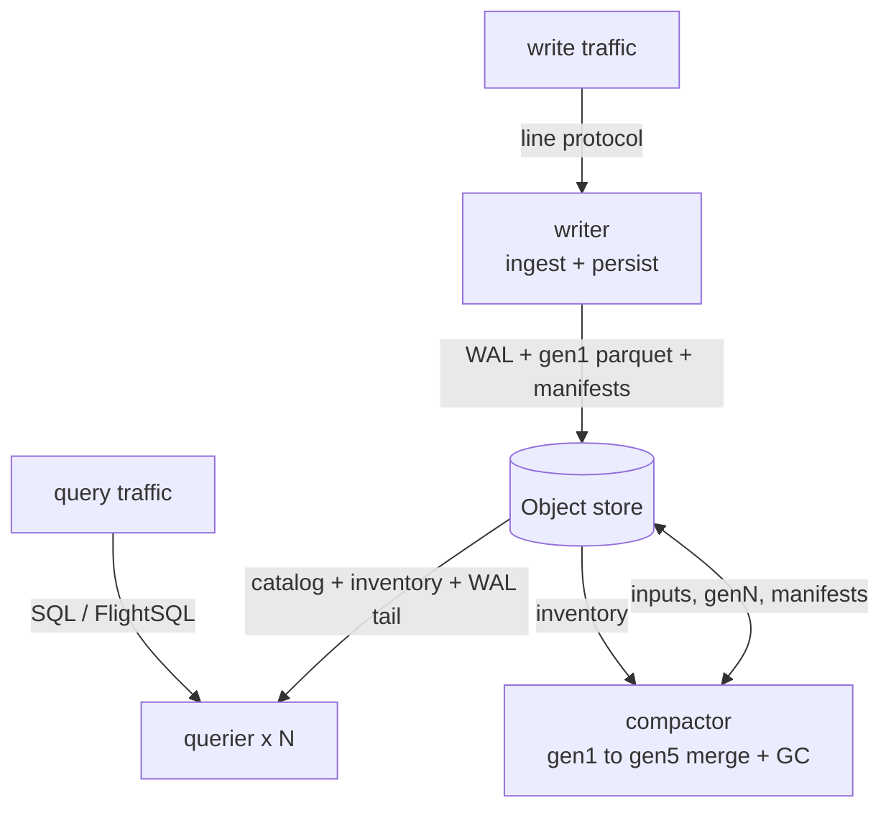

# RefluxDB Extended

An experimental extended build of **InfluxDB3 Core**, layered on top of the
groundwork from the [refluxdb](https://github.com/metrico/influxdb3-unlocked)
project ("InfluxDB3 Unlocked"). It removes the artificial limits in upstream
Core, adds multi-level compaction, splits the binary into writer / compactor /
querier roles for multi-node deployments, and adds a read-your-writes
freshness layer for sub-second visibility of recent writes.

> [!CAUTION]
> **This project is experimental and is not suitable for production use.**
>
> It is a personal research playground for compaction, multi-node layout, and
> query freshness. APIs, on-disk formats, configuration flags, and behavior
> can change without notice, and there is no support, no release schedule,
> and no compatibility promise.
>
> **For production workloads, use the official
> [InfluxDB3 Core](https://github.com/influxdata/influxdb) from InfluxData.**
> It is the supported, stable upstream this fork is built from.

## Lineage

- **[InfluxDB3 Core](https://github.com/influxdata/influxdb)** — the
  upstream database. The supported, production-ready foundation.
- **[refluxdb / InfluxDB3 Unlocked](https://github.com/metrico/influxdb3-unlocked)**
  — the fork that originally lifted the artificial caps (query time range,
  retention, database/table counts, request size, cardinality, telemetry
  defaults) and added the first cut of multi-generation compaction and
  scoped tokens. Excellent groundwork, but the project is unfinished and no
  longer actively maintained against upstream.
- **This repo** — picks up refluxdb's groundwork, keeps it rebased on
  current InfluxDB3 Core, and continues iterating on compaction durability,
  multi-node operation, and query freshness as an experiment.

## What this fork adds

### Limits lifted (inherited from refluxdb)
- Unlimited query time range (no 72h cap)
- Unlimited retention period
- Unlimited databases, tables, columns, tags
- 1 GB HTTP request body, larger last-cache, higher cardinality budget
- Telemetry disabled by default
- Scoped tokens (`db:<name>:<action>`, wildcards, expiry)

### Multi-level compaction
- Generation durations: 1m, 5m, 10m, 30m, 1h, 6h, 12h, 1d, 7d, 30d, 90d, 365d
- Five generation levels with configurable timing and file-count thresholds
- Crash-safe pipeline: upload → publish manifest (`PersistedSnapshot`) →
  delete inputs, with a delete grace period (default 10m) so in-flight
  queriers do not 404
- Per-table compactor claims via conditional object-store puts; the leader
  runs distinct table jobs in parallel, bounded by `--max-concurrent-compactions`
- **Cold-gated retention** (`--keep-generations-trailing-window`): keep
  superseded gen1 until it is provably cold so a lagging querier never reads a
  deleted file (no silent-empty / 404), with a durable cold-GC sweep
  (`--cold-gc-enabled`) to reclaim the overhang

### Multi-node deployment
- Split-mode binary: `serve --mode writer | compactor | querier`
- Shared catalog under `_catalog/`, OCC via `PutMode::Create`
- Shared inventory under `_inventory/` so queriers see writer and compactor
  output cluster-wide; periodic inventory checkpoints bound loader cost
- Advisory leases at `_locks/writer.lease` and `_locks/compactor.lease`
- HTTP listener enforcement: writes return `405` on querier/compactor;
  queries return `405` on compactor
- `influxdb3 migrate catalog --to-shared` to move a single-node catalog
  into the shared layout

### Read-your-writes freshness (A/C layers)
- Sub-second visibility of recent writes on a separate querier without waiting
  for the writer's snapshot cadence. Each query is assembled from two sources,
  deduplicated so the freshest copy of a row always wins:
  - **A — persisted Parquet** folded from the shared inventory (the durable base)
  - **C — WAL tail**: the querier follows the writer's un-persisted WAL files
    from object storage (`--writer-node-ids`), so recent data stays visible
    before its snapshot lands and even if the writer is offline

### Query resilience
- **Disk spill** (`--exec-spill-enabled` / `--exec-spill-dir`): heavy
  dedup/sort over backfill-overlap can exceed a querier's RAM; spilling to disk
  turns an OOM-kill (and the autoheal cascade it triggers) into a slower query
  that completes
- **NotFound-tolerant reads**: a query that resolves a just-deleted parquet ref
  skips it as empty instead of failing — the superseding generation is already
  in the plan; the cold-gate above prevents this from silently hiding data
- Prometheus metrics for the spill pool, cold-gate overhang, cold-GC, and
  tolerated reads on `/metrics`

## Architecture at a glance

The same `influxdb3` binary runs as a **writer**, **compactor**, or **querier**
(or `all`, the upstream single-process mode). The roles share nothing but an
object store — they coordinate through a shared catalog, a shared file
inventory, and advisory leases, all mediated by conditional object-store writes.
No node ever calls another — all coordination flows through the object store.



For the full design — object-store layout, the shared inventory and inventory
poller, multi-level compaction, convergence-gated deletion, the read-your-writes
freshness layers, query-planner changes, observability, and a configuration
reference with sequence diagrams — see **[REFLUXEXTENDED.md](REFLUXEXTENDED.md)**.

## Quick start

```bash
# Local file storage, single node
./influxdb3 serve \
  --object-store file \
  --data-dir /var/lib/influxdb3 \
  --node-id local1
```

Docker:

```bash
docker run -p 8181:8181 \
  -v /data:/var/lib/influxdb3 \
  docker.io/jochen42/refluxdbextended:latest serve \
  --object-store file \
  --node-id local1
```

Multi-level compaction:

```bash
./influxdb3 serve \
  --object-store file \
  --node-id local1 \
  --gen1-duration 5m \
  --gen2-duration 1h \
  --gen3-duration 1d \
  --compaction-interval 30m
```

Authentication is on by default. Create an admin token:

```bash
./influxdb3 create token --admin
export INFLUXDB3_AUTH_TOKEN="apiv3_..."
./influxdb3 query "SHOW DATABASES"
```

To disable auth for development: `--without-auth`.

Health check:

```bash
curl http://127.0.0.1:8181/health
```

## Building from source

```bash
git clone https://github.com/refluxdb/refluxdb
cd refluxdb
cargo build --release --package influxdb3
./target/release/influxdb3 serve --object-store file --node-id local1
```

Build dependencies on Debian/Ubuntu:

```bash
sudo apt-get install build-essential pkg-config libssl-dev clang lld \
    git protobuf-compiler python3 python3-dev python3-pip
```

See [REFLUXEXTENDED.md](REFLUXEXTENDED.md) for the detailed architecture,
[PROFILING.md](PROFILING.md) for profiling builds, and
[README_processing_engine.md](README_processing_engine.md) for notes on the
embedded Python processing engine.

## API compatibility

The HTTP API and on-the-wire query/write protocols remain compatible with
upstream InfluxDB3 Core at the version this fork is rebased on. Existing
InfluxDB3 client libraries, the FlightSQL datasource for Grafana, and the
InfluxDB3 Explorer all work unchanged.

That said: because internal formats and flags can move between revisions of
this fork, do not point existing production clients or dashboards at it
expecting stability.

## License

This project inherits the dual licensing of the upstream InfluxDB3 Core
codebase. You may use it under the terms of either license, at your option:

- Apache License 2.0 — see [LICENSE-APACHE](LICENSE-APACHE)
- MIT License — see [LICENSE-MIT](LICENSE-MIT)

## Acknowledgments

- **InfluxData** for [InfluxDB3 Core](https://github.com/influxdata/influxdb)
  — the database this fork is built on, and the right choice for any
  production deployment.
- **refluxdb / Lorenzo Mangani and contributors** for
  [InfluxDB3 Unlocked](https://github.com/metrico/influxdb3-unlocked), the
  unfinished but invaluable groundwork that made this experiment possible.
