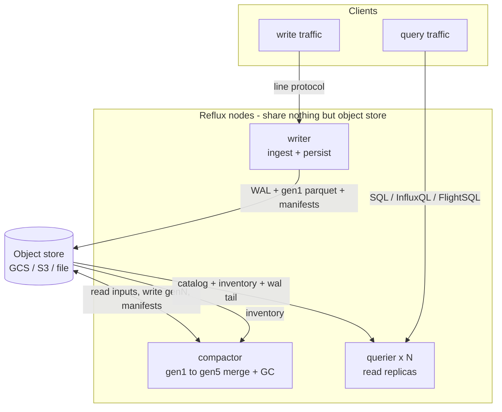
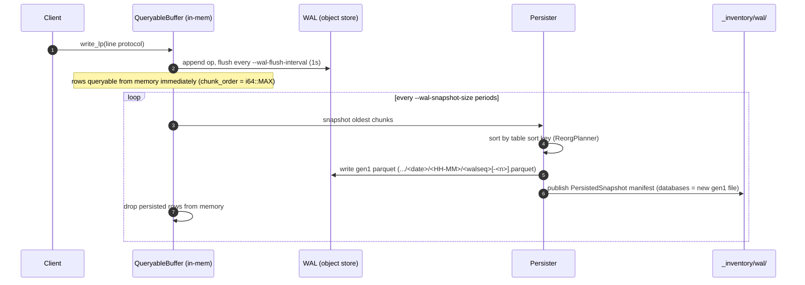
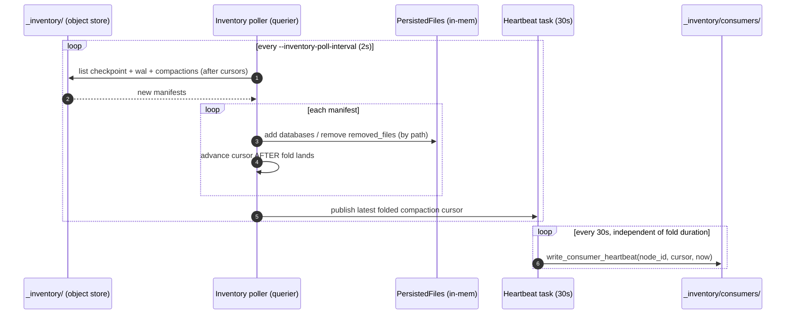
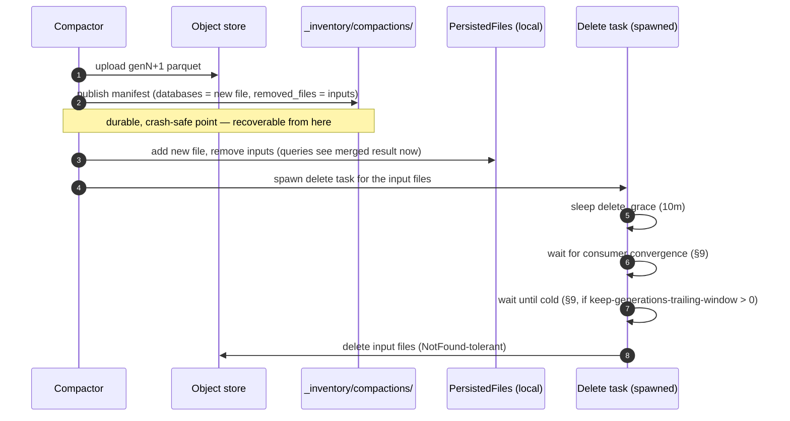
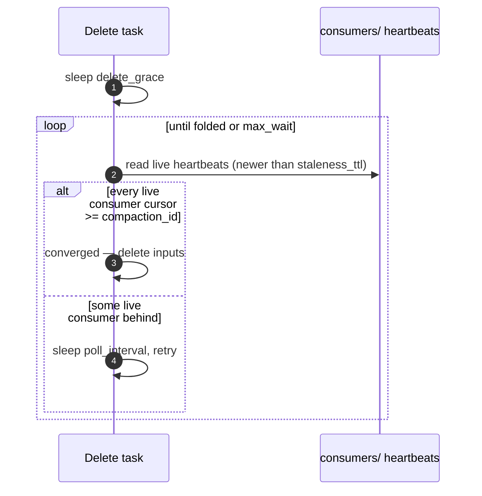
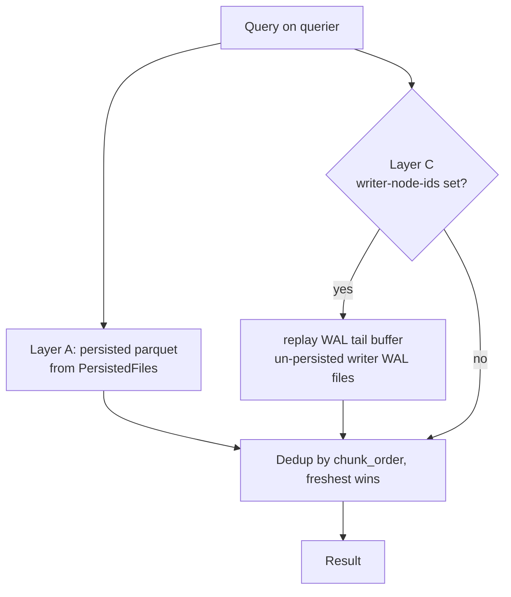

# RefluxDB Extended — Architecture

This document describes the architectural extensions this fork adds on top of
**InfluxDB3 Core** (and the earlier *InfluxDB3 Unlocked* groundwork). It is the
detailed companion to the high-level summary in [README.md](README.md).

> [!NOTE]
> This is an experimental research build. On-disk formats, flags, and behavior
> change without notice. For production use the official
> [InfluxDB3 Core](https://github.com/influxdata/influxdb).

## Table of contents

1. [What changed, in one paragraph](#what-changed-in-one-paragraph)
2. [Node modes and the split binary](#1-node-modes-and-the-split-binary)
3. [Object-store layout](#2-object-store-layout)
4. [Shared catalog and optimistic concurrency](#3-shared-catalog-and-optimistic-concurrency)
5. [Advisory leases](#4-advisory-leases)
6. [The write path](#5-the-write-path-writer)
7. [Shared inventory and the inventory poller](#6-shared-inventory-and-the-inventory-poller)
8. [Inventory checkpoints](#7-inventory-checkpoints)
9. [Multi-level compaction](#8-multi-level-compaction)
10. [Convergence-gated deletion](#9-convergence-gated-deletion)
11. [Phantom-reference validation](#10-phantom-reference-validation)
12. [Read-your-writes freshness (A / C layers)](#11-read-your-writes-freshness-a--c-layers)
13. [Query-planner performance](#12-query-planner-performance)
14. [Observability](#13-observability)
15. [Build and runtime notes](#14-build-and-runtime-notes)
16. [Configuration reference](#15-configuration-reference)
17. [Failure modes and operational notes](#16-failure-modes-and-operational-notes)

---

## What changed, in one paragraph

Upstream InfluxDB3 Core is a single-process database: one node owns the WAL,
the in-memory buffer, persistence to Parquet, and queries. This fork keeps that
single-process mode (`--mode all`) but adds the machinery to **split those
responsibilities across nodes** that share nothing but an object store. A
**writer** ingests and persists; a **compactor** merges small Parquet files
into larger generations; one or more **queriers** answer reads. They coordinate
entirely through the object store: a **shared catalog**, a **shared inventory**
of file manifests, **advisory leases**, and a **read-your-writes freshness
layer** that lets a querier see writes that have not yet been persisted. No
node ever calls another — all coordination is mediated by conditional
object-store writes.

---

## 1. Node modes and the split binary

The same `influxdb3` binary runs in one of four modes, selected by
`--mode` (env `INFLUXDB3_MODE`, default `all`).

`NodeMode` — `influxdb3/src/commands/serve.rs:193`:

| Mode | `runs_ingest()` | `runs_compaction()` | `runs_query()` |
|------|:---:|:---:|:---:|
| `all` | ✓ | ✓ | ✓ |
| `writer` | ✓ | ✗ | ✓ |
| `compactor` | ✗ | ✓ | ✗ |
| `querier` | ✗ | ✗ | ✓ |

Mode drives an `EndpointPolicy` (`influxdb3_server/src/http.rs`) built in
`serve.rs`. The HTTP router enforces it before dispatch: write paths return
**405** unless `allow_write`, and query paths return **405** unless
`allow_query`. A querier therefore physically cannot accept a write, and a
compactor accepts neither writes nor queries.



---

## 2. Object-store layout

Everything durable lives in one bucket. The fork adds the `_catalog`,
`_inventory`, and `_locks` top-level prefixes alongside the upstream per-node
data dirs.

```
<bucket>/
├── _catalog/                       shared catalog (OCC, PutMode::Create)
│   └── catalogs/<seq>.…            sequenced catalog logs + checkpoints
│
├── _inventory/                     cluster-wide file inventory
│   ├── wal/<node_id>/<seq>.info.json        writer WAL snapshot manifests
│   ├── compactions/<ulid>.compaction.json   compactor manifests (time-ordered)
│   ├── checkpoint/<id>.full.json            materialized full-state snapshots
│   └── consumers/<node_id>.json             querier liveness heartbeats
│
├── _locks/                         advisory leases
│   ├── writer.lease
│   └── compactor.lease
│
├── _compactor/claims/              per-table compaction claims (PutMode::Create)
│
├── <writer_node_id>/               writer-owned data (upstream layout)
│   ├── wal/…                       WAL segment files (tailed by queriers)
│   └── dbs/<db>/<table>/<date>/<HH-MM>/<walseq>[-<n>].parquet gen1 files
│
└── <compactor_node_id>/
    └── dbs/<db_uuid>-<id>/<table_uuid>-<id>/genN/<date>/<HH-MM>/<ulid>.parquet
```

A gen1 file is named by the WAL sequence that persisted it. Since upstream
3.9.11 a gen1 chunk that splits into several buffer chunks (a string column at
the Arrow varchar limit) persists one file per split, `<walseq>-<n>.parquet`
for n ≥ 1; the common single-chunk case keeps the bare name. Fork code that
parses gen1 paths (`parse_gen1_path`, tombstone GC) keys on the WAL sequence
and accepts the suffix.

Manifest filenames are chosen so a plain lexicographic `LIST` returns them in a
useful order: WAL snapshots are keyed by `u64::MAX - sequence` (newest first);
compaction manifests and checkpoints use ULID / UUIDv7 (time-sortable). This
lets loaders page and prune by name without opening every object.

A `PersistedSnapshot` manifest (`influxdb3_write/src/lib.rs`) carries two
sets: `databases` (files **added**) and `removed_files` (files **superseded**).
Folding a manifest means applying both. Files are identified **by object-store
path**, never by the process-local `ParquetFileId`, so the same file arriving
from two sources (a checkpoint and a WAL manifest) de-duplicates correctly.

---

## 3. Shared catalog and optimistic concurrency

In any split mode (and optionally in `all` via `--shared-catalog`) the catalog
is opened under the `_catalog` prefix instead of a per-node path —
`Catalog::open_shared` (`influxdb3_catalog/.../v2.rs:236`, prefix constant
`SHARED_CATALOG_PREFIX = "_catalog"` at `:123`). Mode selection is at
`serve.rs:1242`: any mode other than `all` defaults to shared.

There is **no catalog server**. Concurrency control is optimistic, implemented
with conditional object-store writes:

- Sequenced catalog logs are written with `PutMode::Create` (If-None-Match)
  (`v2.rs:206`); a collision returns `AlreadyExists`, which the writer treats
  as "someone else took that sequence — re-read and retry".
- Catalog checkpoints likewise use `PutMode::Create` (`v2.rs:141`).

Every node *reads* the catalog forward on each inventory tick (§6), so a new
table created on the writer becomes queryable on the querier within a poll
interval.

### `gen1_duration` is catalog-wide and set-once

`--gen1-duration` (default `10m`) is stored **in the catalog**, set by the
first node to write it (`serve.rs:1334` calls `catalog.set_gen1_duration`).
Once set it is **immutable**: a later node passing a different value gets
`CannotChangeGenerationDuration`, logs a warning, and adopts the existing
catalog value. Because the call is **not** mode-gated, a querier booting first
on a fresh bucket can lock the catalog to its default `10m`. Set
`--gen1-duration` identically on **all** roles, and recreate the bucket if you
need to change it.

---

## 4. Advisory leases

To keep two writers (or two compactors) from both persisting, each singleton
role takes a lease before doing destructive work — `influxdb3_write/src/leases.rs`.

A `LeaseDoc` (`leases.rs:108`) is JSON: `{owner, acquired_at_unix_ms,
expires_at_unix_ms}`, written to `_locks/writer.lease` or
`_locks/compactor.lease`.

- **Acquire** (`try_acquire`, `:153`): attempt `PutMode::Create`; if it exists,
  read it and only take over via `PutMode::Update(version)` if it has expired.
  The conditional update makes takeover race-free.
- **Refresh** (`:241`): extend `expires_at` every `ttl / 3` via conditional
  update; a precondition failure or 404 means the lease was lost — clear held
  state and stand by.
- **Enforcement**: the writer hard-waits up to `ttl + 5s` to acquire before
  replaying its WAL (`serve.rs:1386`); the compactor checks `lease.is_leader()`
  at the top of every cycle and skips the cycle if it does not hold the lease
  (`compaction.rs:294`).

TTLs are configurable: `--writer-lease-ttl`, `--compactor-lease-ttl` (both
default `60s`; `0s` disables leasing).

---

## 5. The write path (writer)

Ingest is unchanged from upstream up to persistence; the fork's additions begin
where a snapshot is published.



Every snapshot publishes a manifest, **including an empty one** (upstream
3.9.13: a forced snapshot that finds nothing to persist still consumes a
sequence number, and a missing manifest would look like a hole to sequential
consumers). The fork dual-publishes those too, so the inventory poller's
per-writer WAL watermark advances even when no parquet was written — which is
what lets the WAL-tail buffer (§11) evict the corresponding WAL files.
Manifests and inventory checkpoints are written with multipart uploads and
read with size-gated ranged GETs (`put_adaptive` / `get_adaptive`), so a very
large checkpoint — it lists every live file — cannot exceed a single-request
limit.

Key point for the rest of this document: between a write landing in memory and
its gen1 Parquet manifest appearing in `_inventory/wal/`, the data is visible
**only on the writer** (in its `QueryableBuffer`) and in the **WAL segment
files** on the object store. Surfacing that window on a *separate* querier is
the job of the freshness layer (§11).

---

## 6. Shared inventory and the inventory poller

The shared inventory is the cluster's view of "which Parquet files are live".
Writers add gen1 manifests; the compactor adds compaction manifests; queriers
and the compactor **fold** those manifests into an in-memory `PersistedFiles`
map. `SharedInventory` (`influxdb3_write/src/shared_inventory.rs:119`) is a thin
`Arc<dyn ObjectStore>` wrapper; every node holds its own handle.

Each non-ingest consumer runs an **inventory poller**
(`influxdb3_write/src/inventory_poller.rs`) on `--inventory-poll-interval`
(default `2s`). Its `tick()` (`:272`):

1. Pulls the catalog forward (new tables/columns become queryable).
2. `load_all_wal_snapshots(wal_cursors)` — lists `_inventory/wal/<node>/`,
   skipping sequences already folded per writer.
3. `load_all_compactions(compaction_cursor)` — lists
   `_inventory/compactions/`, skipping ULIDs already folded.
4. Folds each manifest into `PersistedFiles` via
   `add_persisted_snapshot_files` (add by path, then remove by path —
   `persisted_files.rs:555`), and **after** each fold lands, advances the
   matching cursor and evicts now-redundant WAL-tail files (§11).
5. Publishes the advanced cursors to a watermark cell the compactor reads.

The first successful tick flips a **readiness gate** — the querier does not
answer queries until it has folded the inventory once, so it never serves an
empty or partial view at boot.



The **heartbeat runs on its own 30-second timer**, decoupled from `tick()`.
This decoupling is load-bearing — see §9.

---

## 7. Inventory checkpoints

Replaying every manifest from the beginning of time would make querier startup
(and every poll) grow without bound as the `_inventory/compactions/` directory
accumulates. The compactor periodically writes a **checkpoint**
(`compaction.rs:407`, every `checkpoint_every_n_cycles`) that collapses history:

A `Checkpoint` (`shared_inventory.rs:425`) holds:

- `merged_snapshot` — a synthetic `PersistedSnapshot` listing **every live
  file** (`snapshot_all()`), with an **empty** `removed_files` (it encodes only
  "what is alive", no tombstones).
- `wal_high_water` — per-writer highest folded WAL sequence.
- `compactions_high_water` — highest folded compaction ULID.

Writing order matters: high-water marks are captured **first**, then phantom
refs are evicted (§10), then the live set is snapshotted — guaranteeing the
merged snapshot is at least as fresh as its watermarks.

A fresh loader (`load_full_state`, `:368`) reads the newest checkpoint, folds
its `merged_snapshot`, then folds **only** WAL/compaction manifests with
id greater than the checkpoint's high-water marks. Startup cost becomes
"one checkpoint + the tail since it", regardless of total history.

---

## 8. Multi-level compaction

The compactor merges many small files into fewer large ones across five
generations. gen1 is whatever the writer persisted (bucketed by
`gen1_duration`); gen2–gen5 come from compaction, each spanning a longer
configurable window.

`CompactionConfig` (`compaction.rs:29`): `generation_durations` (gen→`Duration`),
`interval`, `max_files_per_run` (`--max-compaction-files`, default 100),
`min_files_for_compaction` (default 10), `delete_grace` (default 10m),
`consumer_convergence`, `checkpoint_every_n_cycles`, `claim_ttl` (30m).

A cycle (`compaction.rs`):

1. **Identify jobs** (`identify_compaction_jobs`, `:477`): for each table, group
   live files by generation; a generation with ≥ `min_files_for_compaction`
   files whose span reaches the next generation's window is eligible to compact
   gen*N* → gen*N+1* (capped at gen5).
2. **Claim** (`acquire_claim`, `:1062`): write
   `_compactor/claims/<db>-<table>-genX-to-genY.claim` with `PutMode::Create`.
   Success → this compactor owns that table's job; `AlreadyExists` with a fresh
   claim → skip; `AlreadyExists` but older than `claim_ttl` → take over. Distinct
   tables are claimed independently, so the leader runs **multiple
   table-generation jobs in parallel** (bounded by `--max-concurrent-compactions`;
   see *Concurrency* below). A `ClaimGuard` deletes the claim on drop.
3. **Execute** (`execute_compaction_job`, `:627`): wrap inputs as chunks with
   their declared sort key, build a `ReorgPlanner::compact_plan`, run it through
   DataFusion. Because the inputs are already sorted by the table sort key, the
   plan **merges** rather than full-sorts. Output is one Parquet file whose
   `chunk_time` is computed over the **true** min/max of all rows
   (`write_compacted_file`, `:793`).
4. **Publish** (`publish_compaction`, `:844`): see below.



The sequence is crash-safe: the manifest is the commit point. If the process
dies before the delete task runs, the inputs are simply still present and the
next cycle is idempotent. The delete is deliberately **deferred** so in-flight
queriers that planned against the old inputs do not get a 404.

**Concurrency.** The compactor runs under a **singleton lease** (`compaction.rs`
`is_leader`): only one process compacts at a time; peers are warm standbys, not
extra throughput. Within the leader, distinct table-generation claim groups run
in parallel up to `--max-concurrent-compactions` (default 4); jobs within one
claim group run sequentially. Raise the cap only with more compactor vCPUs —
four concurrent DataFusion merges already saturate four cores. To scale
horizontally you would need to shard the singleton lease (not yet implemented).

---

## 9. Convergence-gated deletion

The delete grace alone is a fixed timer; it cannot know whether a slow querier
has actually caught up. The convergence gate makes deletion wait for **proof**.

`ConvergenceConfig` (`compaction.rs:64`): `staleness_ttl` (300s), `max_wait`
(3600s), `poll_interval` (5s). After the grace, the delete task polls
`all_live_consumers_folded(compaction_id, now, staleness_ttl)`
(`shared_inventory.rs:230`):

- A consumer is **live** if its heartbeat is newer than `staleness_ttl`.
- The gate returns true only if **every live consumer** has a
  `compaction_cursor >= compaction_id` (it has folded the manifest that removed
  these inputs, so it no longer references them).
- Stale consumers are ignored (a dead querier must not wedge GC forever).
- `max_wait` is a backstop: after that, delete anyway.



### Why the heartbeat is decoupled (the 404 root cause)

Earlier, the heartbeat was written at the **end** of each `tick()`. Under heavy
backfill a querier's tick could spend **minutes** folding a large manifest
backlog. Its heartbeat then aged past `staleness_ttl` (5 min) even though the
querier was alive and busy. The gate classified the live-but-slow querier as
**dead**, ignored it, and deleted inputs the querier still referenced — a query
planned on that stale reference then fetched a deleted object and returned
**404 NoSuchKey**. (Measured prod fold-lag was 13–19 min versus a 10-min grace.)

The fix (§6, commit `458ac242ac`) moves the heartbeat onto a **dedicated 30s
task** that publishes the last *folded* cursor independent of how long the
current tick runs. A busy querier keeps looking alive, so the gate keeps holding
deletion until it has genuinely converged. `tick()` was also corrected to
advance the compaction cursor **only after** a fold lands, never before (it
briefly over-reported convergence otherwise).

Remaining hardening (not yet shipped): treat a *fresh* heartbeat with a
*lagging* cursor as an explicit **block** (distinguish "alive but behind" from
"silently dead"), and prune/skip the unbounded `_inventory/compactions/`
directory so per-tick fold work stays well under the grace.

### Cold-gated generation retention (the silent-gap fix)

The convergence gate governs deletion *timing* but cannot help a **future**
querier that boots later and re-folds an old WAL snapshot which still re-lists a
since-deleted gen1. With NotFound-tolerant reads (§10) live, that no longer 404s
— it **silently empties** whole historical partitions (the read is swallowed to
empty), until a querier reboot rebuilds its inventory. The exposure tracks **WAL
recency, not data timestamp**, so it also hits *backfilled old data* whose WAL
snapshots are recent.

The **cold-gate** (`--keep-generations-trailing-window`, `compaction.rs`
`keep_generations_trailing_window`) closes this structurally: after the grace +
convergence gate, the delete task additionally waits until
`now ≥ publish_time + window` before physically deleting the superseded inputs —
so a re-listed gen1 still resolves and returns data. The gate is **wall-clock
since the compaction published** (not `max_time`), which is what protects
recently-written-but-old-timestamp backfill data. `0s` (default) preserves the
prior eager-delete behavior. Size the window to outlast the WAL re-fold window
(`--gen1-lookback-duration`); larger window = more retained gen1 = more storage,
tracked by the `_cold_retained_{files,bytes}` gauges (§13).

The in-task wait is in-process: a **compactor restart mid-window** leaves the
inputs as orphans (storage only, no data loss — same class as the existing
delete-grace leak). **Cold-GC** (`--cold-gc-enabled`) is the durable cleanup: at
inventory-checkpoint time it lists gen1 objects and deletes any that are (1) a
gen1 path, (2) physically older than the window by object `last_modified` (beyond
every querier's re-list window), and (3) absent from the freshly-built live set —
three independent guards (`cold_gc_should_delete`), recomputed from object-store
truth each checkpoint, bounded by `--cold-gc-max-deletes-per-run`. It does **not**
delete not-yet-cold files (that would reintroduce the phantom/silent-gap risk).

---

## 10. Phantom-reference validation

A **phantom reference** is a Parquet path that `PersistedFiles` believes is live
but which does not exist in the object store (e.g. a manifest that referenced a
file whose upload never landed, or a ref outliving a delete). Serving a query
against one yields 404.

`ref_validator` (`influxdb3_write/src/ref_validator.rs`) is a background task
(spawned at startup, re-run every `--ref-validation-interval`, default `1h`).
`validate_once` (`:144`) does **one recursive LIST per node prefix** (cheap, not
per-file HEAD), then evicts from `PersistedFiles` any ref absent from the
listing. It runs:

- at querier boot, gating readiness so phantoms are gone before the first query;
- on the compactor **immediately before writing a checkpoint** (`:442`), so a
  checkpoint never bakes in a phantom that every future loader would inherit.

Eviction is safe because the system invariant is **upload-before-publish** and
**announce-before-delete**: a missing ref is therefore either a never-completed
upload or an already-announced removal — never live data.

---

## 11. Read-your-writes freshness (A / C layers)

A separate querier folds the inventory only every couple of seconds, and the
writer only snapshots gen1 every `--wal-snapshot-size` periods. Naively, a row
just written would be invisible on the querier for seconds. The freshness layer
closes that gap by assembling each query from **two sources**, deduplicated by
**chunk order** so the freshest copy always wins. Wiring is in
`influxdb3_write/src/composite_write_buffer.rs`.

| Layer | Source | Mechanism | `chunk_order` | Config |
|------|--------|-----------|:---:|--------|
| **A** Persisted | committed Parquet (gen1–gen5) | folded from `_inventory/` into `PersistedFiles` | gen/chunk_time (lowest) | always on |
| **C** WAL tail | writer's un-persisted WAL segment files | querier lists + replays the writer's `wal/` into local buffer chunks | `i64::MAX − 2` | `--writer-node-ids` |

Precedence on dedup (IOx keeps the higher `chunk_order` for equal
primary-key + time): writer-local hot (`i64::MAX`, on the writer itself) >
Layer C > Layer A. So the newest copy of a row always wins, with transparent
fallback as layers miss.



### Layer C — WAL tail

`wal_tail.rs` makes the querier a **follower of the writer's WAL**. Each
`--wal-tail-poll-interval` (default `1s`) it lists the writer's `wal/` prefix,
GETs WAL files past its cursor, replays their ops into per-`(writer, table)`
buffer state, and serves them as `BufferChunk`s with `chunk_order =
i64::MAX − 2`. It is pre-materialized and survives the writer being
**offline** — recent data stays visible from the last WAL files the querier
replayed before the writer went away.

Files are evicted two ways:

- **Routine (correctness-safe):** the inventory poller calls
  `evict_up_to(writer, wal_seq)` after folding that writer's snapshot
  (`inventory_poller.rs:318`) — once a WAL file's data is in committed Parquet
  (Layer A), the tail copy is redundant and dropped. Empty manifests count:
  they advance the watermark for WAL files that produced no parquet at all.
- **Backstop (OOM cap):** `--wal-tail-max-files` per writer (default `2000`).

> [!IMPORTANT]
> **Sizing rule** (`serve.rs`): `--wal-tail-max-files` must comfortably exceed
> the writer's *unpersisted window* — roughly `3 × --wal-snapshot-size`. If the
> cap is smaller, it evicts files that are **not yet persisted**, punching a
> query-visible hole in recent data until their snapshot lands. The default was
> raised 64 → 2000 for exactly this reason (`fix(wal-tail): size querier tail
> above writer's unpersisted window`). Startup warns if the cap is below
> `3 × snapshot_size`.

---

## 12. Query-planner performance

Two changes attack the dominant cost of wide aggregations over many overlapping
chunks: a single global de-duplication sort.

### SplitDedup

`core/iox_query/src/physical_optimizer/dedup/split.rs`. Upstream plans a single
global `DeduplicateExec` that must fully sort **all** rows to remove
duplicates — even when 99 % of chunks don't overlap. `SplitDedup` rewrites it:
split the dedup **per partition** (`chunk_time` bucket), then **per time-overlap
group** within a partition, and **drop dedup entirely** for non-overlapping
singletons. Gated by `max_dedup_split` (`config.rs:25`, default `100`) so a
pathological fan-out can't produce a worse plan than the original. Measured
~8× on a representative wide aggregation.

### Declared sort key on persisted chunks

`parquet_chunk_from_file` (`write_buffer/mod.rs:720`) declares the table sort
key on each persisted `ParquetChunk`. Persist and compaction both physically
sort by that key (via `ReorgPlanner`), so the declaration is truthful and lets
DataFusion use `SortPreservingMergeExec` (merge already-sorted inputs) instead
of a full `SortExec` over millions of rows. The in-memory buffer chunk is left
unsorted (no false claim). Safe under schema evolution: new series-key columns
append before `time` and read as constant-null in older files. (The earlier
full-sort was the dominant cost in a measured 6.4 M-row aggregation.)

### Query disk spill

The querier serves parquet from object store into memory; query execution
(sort / `DeduplicateExec` / aggregation) runs **in memory**, bounded only by the
DataFusion memory pool (`--exec-mem-pool-bytes`). The DataFusion `DiskManager`
defaults to **`Disabled`** (`core/iox_query/src/exec.rs`), so a heavy
backfill-overlap dedup that exceeds the pool has nowhere to spill: untracked
arrow/parquet/output allocations push RSS past the VM limit and the kernel
OOM-kills the process — which fails the health probe, triggers an autoheal
recreate, and with few queriers cascades into a query outage.

`--exec-spill-enabled` switches the `DiskManager` to `OsTmpDirectory` (spill to
`/tmp`); `--exec-spill-dir=<path>` uses a specific dir instead (point at a fast
local SSD — but it **must exist and be writable**, or `create_local_dirs` fails
and the process won't start, §16). Either converts an OOM-kill into a *slower*
spilling query that completes — the node survives. `--exec-spill-max-mb` caps
total spill disk (`0` = DataFusion's 100 GB default). Spill is **opt-in**
(default `Disabled` preserves prior behavior). The write/persist executor keeps
an unbounded pool and never spills.

---

## 13. Observability

### Prometheus metrics for the extension components

All exported on the existing `/metrics` endpoint, with bounded attributes (no
per-db / per-table label explosion):

| Subsystem | Metrics (selected) |
|-----------|--------------------|
| Compaction (`compaction.rs:114`) | `influxdb3_compaction_cycles`, `_jobs`, `_bytes`, `_files`, `_rows`, `_cycle_duration`, `_job_duration`, `_claims`, `_checkpoint_writes`, `_input_deletes`, `_cold_retained_files`/`_cold_retained_bytes` (gauges — cold-gate overhang, §9), `_cold_gc_deletes{result}` (cold-GC sweep, §9) |
| Read path (`not_found_tolerant.rs`) | `influxdb3_parquet_notfound_tolerated{phase}` — parquet objects skipped as empty because the object was `NotFound` (stale ref / compaction-deleted before ref validation); `phase=open`/`mid_scan` (§10) |
| Inventory poller (`inventory_poller.rs:89`) | `influxdb3_inventory_poll_ticks`, `_inventory_folded{kind}`, `_inventory_poll_duration` |
| Shared inventory (`shared_inventory.rs:103`) | `influxdb3_shared_inventory_publish{kind,result}` |
| WAL tail (`wal_tail.rs:176`) | `influxdb3_wal_tail_files{result}` |
| Leases (`leases.rs:33`) | `influxdb3_lease_is_leader{lease}` (gauge), `influxdb3_lease_operations{lease,op,result}` |

### Startup health probe

`influxdb3_server/src/startup_probe.rs`. Catalog load and WAL replay can take
long enough that an orchestrator's health check fails and it kills the node
mid-replay — a self-perpetuating crash loop. The probe binds the API port
**first** (`serve.rs:1053`) and runs a tiny HTTP/1.1 responder: health/ping
paths return **200 OK**; everything else returns **503** with `Retry-After: 5`
and a "server is starting" note. When the real server is ready it reclaims the
**same listener socket** (`serve.rs:1834`), so the port never closes and the
`:0`-assigned port never changes. TLS uses the same cert/key.

---

## 14. Build and runtime notes

- **Container vs. VM:** negligible for a `--network host` + bind-mount + no
  cgroup-limit deployment. The binary is the lever, not the wrapper.
- **CPU targeting:** `.cargo/config.toml` sets `-C target-cpu=haswell` for local
  x86_64 builds. CI release (`.github/workflows/release.yml:84`) sets
  `RUSTFLAGS` to only `-C link-arg=-fuse-ld=lld`; because Cargo takes RUSTFLAGS
  from a single source (it does not merge), the CI binary is **generic
  x86_64** — portable across CPU generations but without haswell tuning. Build
  locally for a CPU-tuned binary.

---

## 15. Configuration reference

Extension flags added/changed by this fork (defaults in parentheses):

| Flag | Env | Default | Applies to | Notes |
|------|-----|---------|-----------|-------|
| `--mode` | `INFLUXDB3_MODE` | `all` | all | `all` / `writer` / `compactor` / `querier` |
| `--shared-catalog` | `INFLUXDB3_SHARED_CATALOG` | (auto) | all | forced on for non-`all` modes |
| `--gen1-duration` | `INFLUXDB3_GEN1_DURATION` | `10m` | writer (catalog-wide) | **set-once, immutable**; set on all roles |
| `--gen2-duration`…`--gen5-duration` | `INFLUXDB3_GEN{2..5}_DURATION` | — | compactor | per-generation window |
| `--enable-compaction` | `INFLUXDB3_ENABLE_COMPACTION` | `true` | compactor/all | |
| `--compaction-interval` | `INFLUXDB3_COMPACTION_INTERVAL` | `1h` | compactor | cycle cadence |
| `--max-compaction-files` | `INFLUXDB3_MAX_COMPACTION_FILES` | `100` | compactor | inputs per job |
| `--min-files-for-compaction` | `INFLUXDB3_MIN_FILES_FOR_COMPACTION` | `10` | compactor | trigger threshold |
| `--max-concurrent-compactions` | `INFLUXDB3_MAX_CONCURRENT_COMPACTIONS` | `4` | compactor | distinct-table compaction jobs the leader runs in parallel per cycle; raise only with more vCPUs (§8) |
| `--compaction-delete-grace` | `INFLUXDB3_COMPACTION_DELETE_GRACE` | `10m` | compactor | defer input delete |
| `--keep-generations-trailing-window` | `INFLUXDB3_KEEP_GENERATIONS_TRAILING_WINDOW` | `0s` | compactor | **cold-gate**: keep superseded gen{N-1} objects this long *after the compaction publishes* before deleting, so a querier re-listing a still-foldable gen1 still resolves (§9). `0s` = eager delete. Size ≥ the WAL re-fold window. |
| `--cold-gc-enabled` | `INFLUXDB3_COLD_GC_ENABLED` | `false` | compactor | durable sweep of superseded gen1 that leaked past the cold-gate (e.g. compactor restart); requires the window > 0 (§9) |
| `--cold-gc-max-deletes-per-run` | `INFLUXDB3_COLD_GC_MAX_DELETES_PER_RUN` | `5000` | compactor | bound per cold-GC sweep |
| `--exec-spill-enabled` | `INFLUXDB3_EXEC_SPILL_ENABLED` | `false` | querier | DataFusion disk spill to the OS temp dir; converts a query-OOM into a slower spilling query (§12) |
| `--exec-spill-dir` | `INFLUXDB3_EXEC_SPILL_DIR` | (unset) | querier | spill to this dir instead of OS temp; **must exist and be writable** by the process (else startup fails) — implies enabled (§12) |
| `--exec-spill-max-mb` | `INFLUXDB3_EXEC_SPILL_MAX_MB` | `0` | querier | cap total spill on disk; `0` = DataFusion default (100 GB) |
| `--writer-lease-ttl` | `INFLUXDB3_WRITER_LEASE_TTL` | `60s` | writer | `0s` disables |
| `--compactor-lease-ttl` | `INFLUXDB3_COMPACTOR_LEASE_TTL` | `60s` | compactor | `0s` disables |
| `--inventory-poll-interval` | `INFLUXDB3_INVENTORY_POLL_INTERVAL` | `2s` | querier/compactor | fold cadence |
| `--ref-validation-interval` | `INFLUXDB3_REF_VALIDATION_INTERVAL` | `1h` | querier/compactor | phantom-ref sweep |
| `--writer-node-ids` | `INFLUXDB3_WRITER_NODE_IDS` | (empty) | querier | Layer C WAL-tail prefixes |
| `--wal-tail-poll-interval` | `INFLUXDB3_WAL_TAIL_POLL_INTERVAL` | `1s` | querier | `0s` disables tail |
| `--wal-tail-max-files` | `INFLUXDB3_WAL_TAIL_MAX_FILES` | `2000` | querier | **must exceed 3 × snapshot-size** |

Valid generation durations (`influxdb3_wal/src/lib.rs`): `1m`, `5m`, `10m`,
`30m`, `1h`, `6h`, `12h`, `1d`, `7d`, `30d`, `90d`, `365d`. Anything else is
rejected at startup.

---

## 16. Failure modes and operational notes

| Symptom | Cause | Mitigation |
|---------|-------|-----------|
| 404 `NoSuchKey` on a recent query | live-but-slow querier mis-classified dead → premature input delete (§9) | fixed by 30s decoupled heartbeat; keep fold-lag ≪ `delete_grace`, raise `--wal-tail-max-files`, compact faster |
| Recent data missing on querier until next snapshot | `--wal-tail-max-files` below the writer's unpersisted window (§11) | set it ≥ `3 × --wal-snapshot-size` |
| `gen1` stuck at `10m` despite `--gen1-duration=1h` | catalog set-once won by an earlier node (often a querier with the default) (§3) | set `--gen1-duration` on **all** roles; recreate the bucket to change |
| Compactor mis-buckets gen1 | compactor's `generation_durations[1]` reads the **flag**, not the catalog value | keep `--gen1-duration` identical to the writer/catalog on the compactor |
| Slow wide aggregations under backfill | global dedup not split because backfill overlaps compacted data (§12) | compact the backfill window faster (shrinks the overlapping un-compacted set) |
| Whole historical window silently empty until querier reboot | querier re-lists a compaction-deleted gen1 from a still-foldable WAL snapshot; NotFound-tolerant reads swallow it to empty (§9/§10). Tracks WAL recency, so hits backfilled old data too | enable the cold-gate `--keep-generations-trailing-window` ≥ the WAL re-fold window; watch `_parquet_notfound_tolerated`; reboot queriers to clear an existing gap |
| Querier OOM-killed → autoheal recreate → cascade/outage | heavy `DeduplicateExec`/sort over backfill-overlap exceeds RAM; no disk spill (§12). With few queriers the load shifts to the survivor, which OOMs too | `--exec-spill-enabled` (query spills instead of OOM); more querier replicas / RAM; compact faster to shrink the overlap |
| New queriers autoheal-loop ~`initialDelaySec` after boot, healthy ones stay | `--exec-spill-dir` points at a missing/unwritable path → DataFusion `create_local_dirs` fails → process won't start → fails health (§12) | make the dir exist + writable, or use `--exec-spill-enabled` (OS temp), or point at a writable mount |
| Node killed during startup by autohealing | health check failed during catalog/WAL replay | startup probe (§13) answers health 200 before readiness — ensure probe path is the LB health path |

---

*See [README.md](README.md) for the project overview, lineage, and quick start.*
